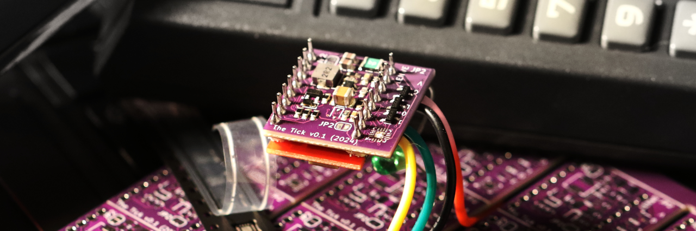
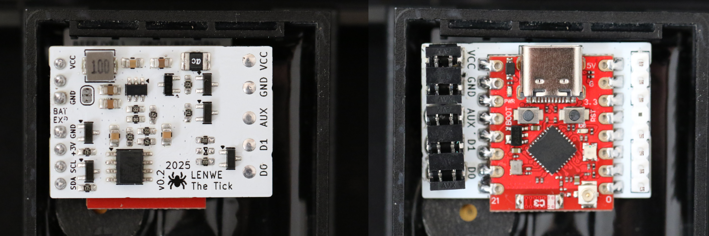
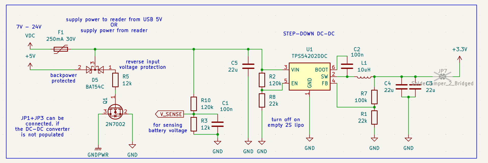
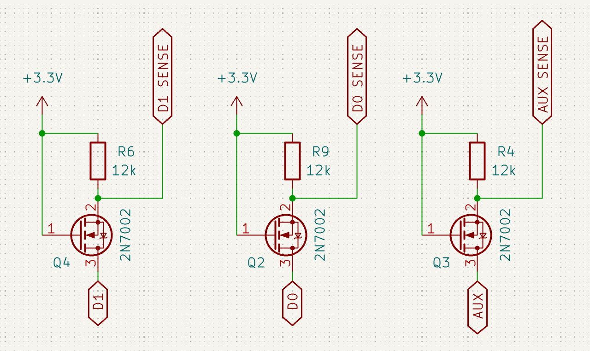
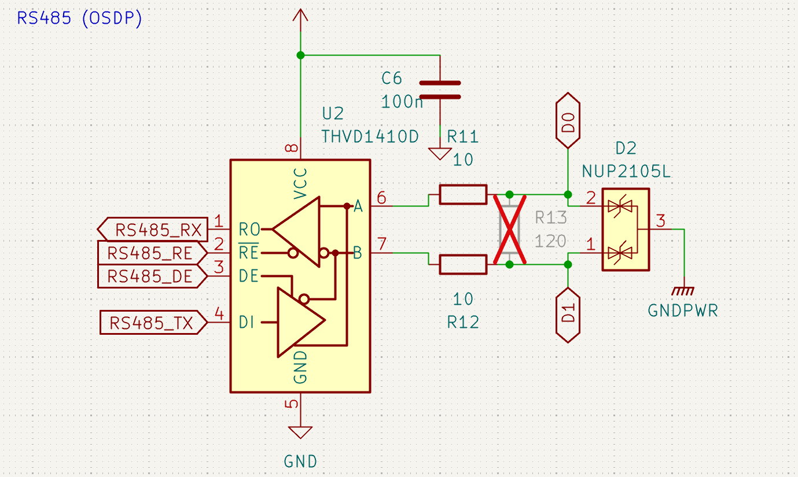
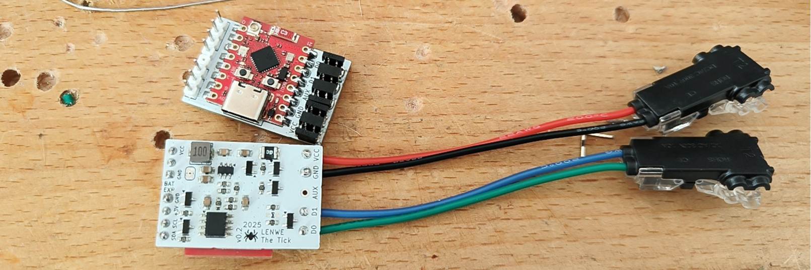

# The Tick

  

**The Tick** is the next evolution in covert access control system implants. Designed for a seamless integration behind card readers, The Tick silently intercepts, logs, and replays access credentials with greater efficiency and stealth than ever before. Compatible with a wide range of RFID systems, provides invaluable (to red teamers) insights into facility (in)security, while enabling advanced credential injection. Whether for security auditing, red teaming, or mobile access control testing, The Tick delivers a compact, powerful, and flexible solution in an ever-connected world.

## Comparison to other projects

|  | BLEKey | ESP-RFID-Tool | ESPKey | The Tick |
| -- | -- | -- | -- | -- |
| supported protocols | Wiegand | Wiegand | Wiegand | Wiegand **+ Magstripe Clock&Data + a bit of OSDP** |
| wireless interfaces | BLE | WiFi | WiFi | **BLE +** WiFi |
| configurable D0/D1 lines  | ❌ | ❌ | ❌ | ✅ |
| max power supply voltage | battery powered | 🔥 | 18V DC | **25V** DC |
| max data line voltage | 5V | 5V | 5V | **16V** |
| SoC | nRF51822 | ESP8266 | ESP8266 | **ESP32C3** |
| firmware | properly structured code | time-efficient code soup | time-efficient code soup | **slightly-organized** code soup |
| arachnophobia-safe | ✅ | ✅ | ✅ | ❓ (partially, hidden mugga-mode) |

While expanding the feature range, the device still preserves the convenient, small footprint:

  

## Software

Firmware of this device started as a simple port of [ESPKey](https://github.com/octosavvi/ESPKey) for ESP32C3, that gradually grew into extensible and multi-protocol software project, with own improved hardware.

### Features

Currently, the firmware can be built with following features:

#### Communication interfaces

| build flag         | description                                                                   |
|--------------------|-------------------------------------------------------------------------------|
| USE_BLE            | BLEKey-style Bluetooth Low Energy support                                     |
| USE_WIFI           | ESPKey-style WiFi (station or client) support                                 |
| USE_HTTP           | HTTP user interface                                                           |

#### Firmware upgrade

| build flag         | description                                                                   |
|--------------------|-------------------------------------------------------------------------------|
| USE_OTA            | Arduino-style over-the-air upgrade                                            |
| USE_OTA_HTTP       | HTTP endpoint for upgrading firmware                                          |

There's an USB connector on-board, that even features embedded JTAG interface, but why not...

#### External reporting

| build flag         | description                                                                   |
|--------------------|-------------------------------------------------------------------------------|
| USE_MDNS_RESPONDER | broadcasts MDNS, so hostname instead of IP address can be used for a connection |
| USE_SYSLOG         | reports interactions to syslog server                                         |
| USE_LCD            | reports interactions to a handy I2C OLED display                              |

#### Wire protocols

| build flag         | description                                                                   |
|--------------------|-------------------------------------------------------------------------------|
| USE_WIEGAND        | provides support for Wiegand interface sniffing and transmitting              |
| USE_CLOCKANDDATA   | provides support for clock&data interface sniffing and transmitting           |
| USE_OSDP           | enables building with libosdp                                                 |
| USE_OSDP_PD        | provides support for OSDP Peripheral Device mode                              |
| USE_OSDP_CP        | provides support for OSDP Control Panel mode                                  |

**In Wiegand mode**, the device can receive (sniff) and transmit messages of any length.  
Assignment of D0 and D1 lines can be corrected in the configuration file after the device installation, if needed.  
The device was sucessfuly tested with 5V and 12V PACS systems, that uses different card number lengths.

**In Clock&Data mode**, the device can receive and transmit messages of any reasonable length.  
Assignment of DATA and CLOCK lines can be corrected in configuration file after the device installation, if needed.  
The device was sucessfuly tested with 12V Clock&Data system, running in Magstripe and UNITEK-emulation modes.  
Support for Paxton decoding is based on samples provided by [en4rab](https://github.com/en4rab/sigrok-paxton-pd).

### Build instructions

Open the project in PlatformIO and press "Upload", then "Upload Filesystem Image". The code is Arduino-flavoured, but takes too long for me to compile using Arduino IDE.

### HTTP interface

If built with *USE_HTTP* flag, the device provides a quite-eye candy, simple HTTP interface, based on almost-REST API and built using jQuery and Bootstrap.

Currently, it offers following features:

* review and modification of application configuration files,
* review of sniffed reader interactions,
* replay of acquired credentials,
* sending arbitrary card numbers (raw or encoded in common formats)

### BLE interface

If built with *USE_BLE* flag, the device exposes a custom Bluetooth Low Energy interface:

Currently, it offers following features:

* reading the last sniffed card,
* notifying about new interactions,
* sending arbitrary card number.

Currently, by default, device requires bonding with pre-configured passkey and use of secure connections.

Feature-wise it is simillar to [BLEKey](https://github.com/linklayer/BLEKey) by Mark Baseggio and Eric Evenchick, but running on a decade-younger hardware.

By default, functions are exposed in service *f498124f-2137-4615-9859-30eb4cecffb5* as characteristic *beb5483e-36e1-4688-b7f5-ea07361baaaa*. These UUIDs can be modified in the device configuration.

There is planned a Flipper Zero client, that will be publicly released shortly after BLE Central role will be incorporated in its firmware (probably never).

### OTA upgrade

By properly configuring the build flags, the firmware can feature OTA-upgrade. BLE may need to be sacrificed to fit two copies of firmware in device flash.

It is possible to use Arduino-style OTA (but I never did) or upload firmware images over HTTP endpoint, depending on the build configuration.

## Configuration reset

1. You need to get the timing Just Right™,
2. Start watching [new emergency number spot from IT Crowd](https://youtu.be/HWc3WY3fuZU),
3. When ambulance appears on the screen, connect The Tick to power source (e.g. USB) or press RST button,
4. When each of digits "881 999" appears on the screen, briefly press "BOOT" button,
5. Wait few seconds - the device will start with empty configuration and log files and expose WiFI hotspot.

## Hardware

The device not only fits behind readers, but also fits the cheapest G3061 hot-plate you can get.
It solders nicely with carelessly and generously hand applied solder paste:

When hand-soldering without a hot-plate, to limit accidential damage:

* start with assembling DC-DC converter,
* verify if it works correctly,
* close apropriate solder bridges,
* populate Wiegand level converter,
* populate ESP32-C3 module,
* program the device,
* check if correct voltage levels are visible in HTTP interface,
* proceed with populating RS485 transceiver,
* verify that Wiegand still works,
* finish with the connectors.

### ESP32-C3

The device utilizes ESP32-C3FH4 on a ready-made TENSTAR ESP32-C3 SuperMini Plus module.
Some of the non-Plus modules comes with incorrect antenna design, resulting in [impresively poor WiFi range](https://www.reddit.com/r/esp32/comments/1dsh3b5/warning_some_c3_super_mini_boards_have_a_design/).
For a better range, implementing an [antenna mod](https://peterneufeld.wordpress.com/2025/03/04/esp32-c3-supermini-antenna-modification/) may be a good option.

### DC-DC converter

As no linear voltage regulator in used, both power consumption and heat dissipation is minimal.
The device is also protected against reverse polarity - it just doesn't start, but doesn't blow up.

The power supply can use two pin-compatible PMICs:

Schematics of revisions 0.1 and 0.2A:

* Uses [LMR51430](https://www.ti.com/product/LMR51430) synchronous buck step-down converter, rated at up to 36V.
* It runs at 1.1 MHz switching frequency, and uses relatively small 2.2uH inductor.
* Is probably a bit low-noise and more power-efficient.

Schematics for revision 0.2B:

* Uses [TPS54202](https://www.ti.com/product/TPS54202) synchronous buck step-down converter, rated at up to 28V.
* It runs at 500 kHz switching frequency, and uses common 10uH inductor.
* Is definitely more cost-effective.

Both designs were verfied to work just fine, so I'd recommend assembling using whatever is available.

Maximum voltage if further limited by voltage rating of installed capacitor and polyfuse, but components from the BOM are sufficient to safely run it with 24V-powered long-range readers.

### Battery operation

The device DC-DC converter is configured to turn off at approximately at 6V and start at 6.4V, to provide an overdischarge protection if the device is operated from 2S lithium-ion polymer battery pack. The additional load (e.g. the connected reader) is not covered by this protection.
Battery voltage can be measured using device ADC and read in device web interface.

3-pin connector present on the board follows the same pinout, as balancer plugs presents on the battery packs.

### Level shifter

Absolute maximum drain-source voltage rating for 2N7002 N-channel MOSFET transistor is 60V.
The board is definitelty not designed for such volatage and I advise against connecting it to live installations of such voltage levels, but it is much more than 5-12V usually found in access control systems anyway.

Voltage shifter is derived from "Bi-directional level shifter for I²C-bus and other systems" design described in Philips Semiconductors application note [AN97055](https://cdn-shop.adafruit.com/datasheets/an97055.pdf).  
This solution:

* works properly in installations with external pull-up (e.g. provided by the reader sharing the same line) regardless of the voltage levels,
* provides a convenient way of pulling it down to GND,
* does not provide a way of pulling the line up to VCC.

### RS-485 transceiver

The device design incorporates [THVD1410](https://www.ti.com/product/THVD1410) / [THVD2410](https://www.ti.com/product/THVD2410) transceiver intended for interacting with OSDP systems.
Populating the transceiver on the PCB limits maximum safe communication lines voltage to 18V / 70V respectivly.
It is configured in half-duplex, low-speed mode. Bus terminator can be populated to the PCB, but is usually not required for proper operation.
In non-OSDP modes, the device firmware configures the transceiver into high impedance mode to avoid interferrence.

### LCD support

The device supports connecting SSD1306-based 128X32 OLED to visualize reader interactions.  
Two Wire Interface Bus is available on a dedicated LCD connector.

### Solder bridges

The PCB revision 0.2A features 4 solder bridges for configuring power routing:

* when operating a board with fully populated DC-DC converter, solder bridges JP2 and JP7 should be closed,
* when using a simplified version, JP3 must be closed to connect grounds and JP1 may be closed to provide 5V to the connected reader.

### Connectors

The current PCB revision uses KYOCERA AVX insulation displacement connectors of 9176-000 series that support wires up to 20 AWG. This configuration is inteded for field-use.

If IDC connectors are not needed or there're special requirement for adapting device for thicker wires, footprint incorporates holes for connecting a wire:

* For firmly connecting devices on a desk, I personaly use a short 22 AWG silicon cable with [WAGO 221 series splicing connectors](https://www.wago.com/gb/installation-terminal-blocks-and-connectors/splicing-connector-with-levers/p/221-613).
* For easily connecting to non-standard cables, I'd recommended to use "automotive" IDC T2 [tap connectors](https://aliexpress.com/i/1005005768342063.html).

## Contributing

If you want to contribute to a project and make it better, your help is very welcome. Contributing is also a great way to learn more about social coding on Github, new technologies and and their ecosystems and how to make constructive, helpful bug reports, feature requests and the noblest of all contributions: a good, clean pull request.

I recognize that contributing to hardware projects can be more challenging than software, especially without access to the necessary components. If you're interested in helping out but lack the hardware, drop me an email — I may be able to send you a PCB to get started.

## License

### Software License

The software for "The Tick" is licensed under the GNU General Public License (GPL) v3.0. This license allows you to freely use, modify, and distribute the software, provided that any distribution or derivative works are also licensed under the GPL.

For more details on the GNU GPL v3.0, please refer to the [GNU General Public License v3.0](LICENSE.md).

### UI Libraries And Template License

The user interface of "The Tick" utilizes jQuery and Bootstrap, both of which are licensed under the MIT License. This permissive license allows you to freely use, modify, and distribute the code, with minimal restrictions.

For more details on the MIT License, please refer to the [MIT License](LICENSE.template.md).

### Hardware License

The hardware design for "The Tick" is licensed under the CERN Open Hardware Licence Version 2 - Strongly Reciprocal (CERN-OHL-S v2). This license permits the use, distribution, and modification of the hardware design, with the condition that any derived works must also be licensed under the same terms.

For more details on the CERN-OHL-S v2, please refer to the [CERN Open Hardware Licence Version 2 - Strongly Reciprocal](LICENSE.hardware.txt).
